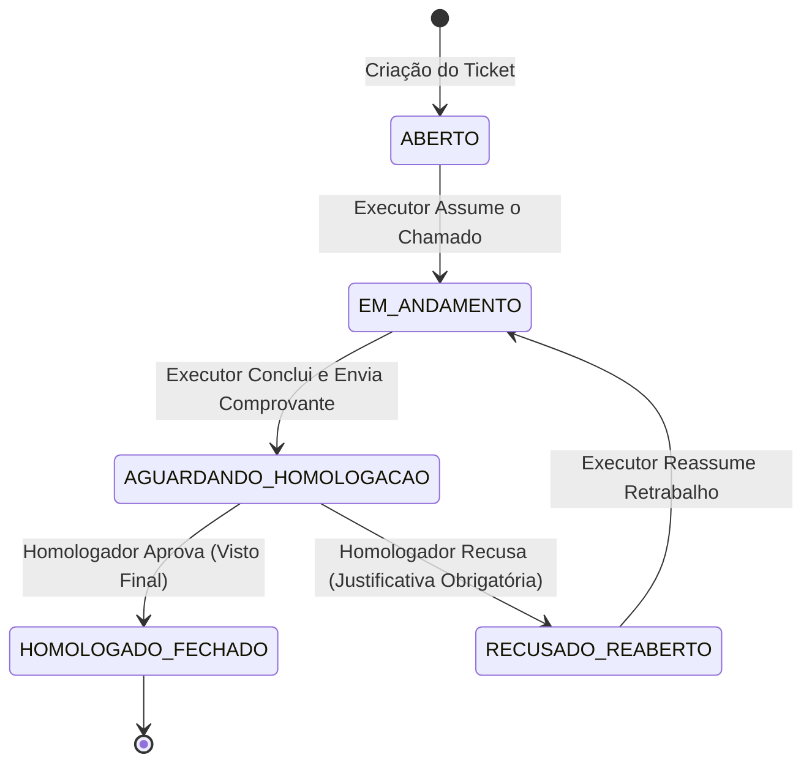

# AGENTS.md — Manual de Engenharia e Governança para Desenvolvimento Guiado por IA

> **Status:** Ativo  
> **Projeto:** OmniFlux — Plataforma de Gestão de Tickets, Governança Operacional e Workflow Multi-Setorial  
> **Modelo de Arquitetura:** Single-Tenant (Self-Hosted)  
> **Público:** Agentes Autônomos de IA e Engenheiros de Software  

---

## 1. INTRODUÇÃO E FILOSOFIA DO SISTEMA

O **OmniFlux** é uma aplicação corporativa Open Source concebida para gerenciar chamados internos, conformidade operacional e aprovações intersetoriais em organizações de qualquer porte.

Todas as IAs que atuarem na evolução desta base de código devem obrigatoriamente seguir as diretrizes estabelecidas neste documento. Desvios arquiteturais, introdução de anti-patterns ou quebras de convenções de tipagem e segurança serão rejeitados.

---

## 2. REGRAS INEGOCIÁVEIS DE ARQUITETURA

### 2.1. Arquitetura Estritamente Single-Tenant (Self-Hosted)
- **NUNCA** adicione abstrações de multi-inquilino (*multi-tenancy*), tais como `tenant_id`, `company_id`, `organization_id` ou esquemas isolados por cliente.
- Cada implantação do OmniFlux pertence integral e exclusivamente a uma única organização. Toda simplificação de modelo deve priorizar integridade relacional direta, clareza e performance sem overhead de partições virtuais.

### 2.2. Motor de Setores Dinâmicos e Parametrizáveis
O OmniFlux não possui fluxos hardcoded para setores específicos. O sistema se comporta como uma engine configurável orientada a metadados:
- **Setores Customizáveis:** Cadastrados pelo administrador (`TI & Suporte`, `Manutenção Predial`, `Financeiro`, `RH`, etc.).
- **Flags de Comportamento:** Controlam a interface e os requisitos de negócio dinamicamente:
  - `is_financial` (*boolean*): Quando verdadeiro, habilita campos de valor monetário (`amount` / R$) e data de vencimento (`due_date`).
  - `requires_proof_file` (*boolean*): Quando verdadeiro, torna o anexo de comprovante/foto obrigatório para conclusão da execução.
  - `allowed_proof_types` (*enum/array*): Especifica os tipos aceitos (`IMAGE`, `DOCUMENT`, `ALL`).
  - `is_restricted` (*boolean*): Se falso, qualquer usuário autenticado pode abrir chamado para este setor. Se verdadeiro, apenas usuários explicitamente vinculados ou autorizados podem emitir chamados.

### 2.3. Matriz de Acesso e RBAC por Setor
As permissões são resolvidas em duas dimensões: o papel global do usuário e os vínculos específicos por setor:
- **SOLICITANTE:** Pode abrir tickets nos setores permitidos e acompanhar chamados de sua autoria.
- **EXECUTOR:** Pode visualizar a fila do setor ao qual está alocado, assumir tickets (`EM_ANDAMENTO`), submeter pareceres e anexar comprovantes para homologação.
- **HOMOLOGADOR / APROVADOR:** Gestor com autoridade para revisar os tickets em `AGUARDANDO_HOMOLOGACAO`, aprovando com visto final ou recusando com justificativa formal de retrabalho.
- **ADMIN_GERAL:** Acesso irrestrito ao sistema, configurações globais, cadastro de setores, auditoria e gestão de usuários.

### 2.4. Máquina de Estados Imutável do Ticket
O ciclo de vida de um chamado segue estritamente a máquina de estados abaixo. Nenhuma transição fora deste grafo é permitida:



- Qualquer transição de estado deve gerar um registro imutável na tabela de histórico de auditoria (`ticket_history` / `audit_logs`), registrando: `ticket_id`, `user_id`, `from_status`, `to_status`, `reason` (obrigatório em caso de recusa), e `created_at`.

---

## 3. PADRÕES DE ENGENHARIA E CÓDIGO LIMPO

### 3.1. TypeScript Estrito (Zero Tolerância com `any`)
- O uso de `any` é **terminantemente proibido**.
- Utilize `unknown` com guardas de tipo (*type guards*) ou esquemas de parsing quando a entrada for incerta.
- Habilite e respeite todas as flags estritas do compilador (`strict: true`, `noImplicitAny: true`, `strictNullChecks: true`).
- Defina tipos claros para parâmetros de entrada, DTOs e retornos de funções.

### 3.2. Validação Exaustiva com Zod
- Todos os formulários, Server Actions e endpoints de API devem validar as entradas através de schemas Zod.
- Use `safeParse` e retorne estruturas de erro padronizadas.
- Centralize schemas em `@/lib/validators` ou subpastas de features correspondentes.

### 3.3. Padrão Estruturado de Resposta (Result Pattern)
Server Actions devem retornar uma estrutura discriminada previsível:

```typescript
export type ActionResponse<T = unknown> = 
  | { success: true; data: T; message?: string }
  | { success: false; error: string; fieldErrors?: Record<string, string[]> };
```

---

## 4. DIRETRIZES DO NEXT.JS (APP ROUTER)

### 4.1. Server Components (RSC) por Padrão
- Todos os componentes são Server Components por padrão.
- Adicione `'use client'` **apenas** nos nós de folha que necessitem de interatividade de UI (hooks de estado, listeners de clique, bibliotecas de componentes clientes do Radix/Shadcn).
- **NUNCA** transforme layouts inteiros ou páginas em Client Components apenas para manipular um botão ou formulário.

### 4.2. Segurança e Autorização em Server Actions
- Não confie nas validações do cliente.
- Toda Server Action deve:
  1. Validar a sessão do usuário chamador via `getServerSession` / `auth()`.
  2. Validar as permissões de acesso (RBAC global e por setor).
  3. Validar a integridade do payload com schema Zod correspondente.
  4. Executar a operação no Prisma dentro de uma transação (`prisma.$transaction`) se envolver múltiplas mutações.
  5. Acionar `revalidatePath` ou `revalidateTag` para manter o cache consistente.

---

## 5. GOVERNANÇA DE BANCO DE DADOS (PRISMA ORM & POSTGRESQL)

### 5.1. Nomenclatura e Convenções do Schema
- Tabelas no banco de dados devem utilizar `snake_case` no plural, mapeadas via `@@map("table_names")`.
- Colunas no banco de dados devem utilizar `snake_case`, mapeadas via `@map("column_name")`.
- Os modelos e atributos no Prisma devem utilizar `PascalCase` para models e `camelCase` para propriedades TypeScript.
- Todas as chaves primárias devem utilizar UUID v4 (`@id @default(uuid())`).
- Campos temporais padrão em todas as tabelas transacionais:
  - `createdAt DateTime @default(now()) @map("created_at")`
  - `updatedAt DateTime @updatedAt @map("updated_at")`

### 5.2. Ciclo de Migrations
- Em desenvolvimento: crie migrações atômicas e declarativas via `npx prisma migrate dev --name <descricao_da_migracao>`.
- **NUNCA** edite migrações existentes que já foram aplicadas.
- Mantenha chaves estrangeiras com índices explícitos (`@@index([column_name])`) para otimização de joins no PostgreSQL.

### 5.3. Estratégia de Seed Idempotente
- O arquivo `prisma/seed.ts` deve ser estritamente idempotente utilizando `upsert`.
- O seed deve criar apenas o usuário administrador inicial (`ADMIN_GERAL`) e setores de exemplo essenciais se inexistentes.
- **PROIBIDO:** Inserir dados mock desnecessários ou sujar o banco com tickets falsos no seed principal.

---

## 6. MÍDIA, COMPROVANTES E STORAGE S3

### 6.1. Abstração por Adapter (`StorageService`)
- Toda operação de upload, leitura de URL ou deleção de arquivo deve ser feita através de uma interface abstrata `StorageService`.
- A implementação concreta usará o `@aws-sdk/client-s3`, funcionando de maneira idêntica com o MinIO local ou AWS S3 / Cloudflare R2 em produção.

### 6.2. Regras de Upload e Sanitização
- **Validação de MIME Type:** Permitir apenas formatos seguros (`image/jpeg`, `image/png`, `image/webp`, `application/pdf`).
- **Validação de Tamanho:** Rejeitar arquivos que excedam o limite configurado (`MAX_UPLOAD_SIZE_MB`).
- **Nomes de Arquivo Criptografados:** Nunca salve o nome original enviado pelo cliente diretamente no storage. Gere chaves compostas e não adivinháveis:  
  `tickets/{ticketId}/{stage}/{uuid}-{sanitizedName}`.

---

## 7. ROTEIRO DE PRÓXIMAS SESSÕES (FASES DO PROJETO)

As implementações de código nas próximas sessões devem obedecer rigorosamente à seguinte sequência lógica:

- [x] **Fase 1: Fundação Arquitetural e Governança** (Configuração de repositório, Docker, Dockerfile, AGENTS.md, README.md).
- [x] **Fase 2: Schema Prisma e Modelagem Relacional** (Tabelas de Usuários, Setores, Permissões por Setor, Tickets, Anexos e Histórico de Auditoria).
- [ ] **Fase 3: Autenticação e Matriz de Autorização RBAC** (NextAuth.js/Auth.js com Credentials/JWT, proteção de rotas e middleware).
- [ ] **Fase 4: Motor de Setores e Máquina de Estados de Tickets** (Server Actions de transição de estado, regras de homologação e validação de comprovantes).
- [ ] **Fase 5: Interface do Usuário (UI/UX) e Componentização PWA** (Tailwind CSS, Shadcn/UI, formulários dinâmicos de setores, manifest PWA).
- [ ] **Fase 6: Camada de Auditoria, Notificações e Métricas** (Relatórios de conformidade, painel do administrador e histórico imutável).

---

> *Atenção Agente: Não quebre este contrato. Sempre verifique este documento antes de propor mudanças estruturais ou gerar novos módulos.*
